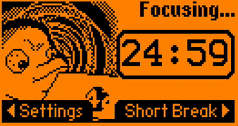
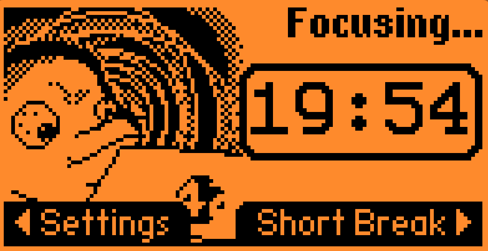
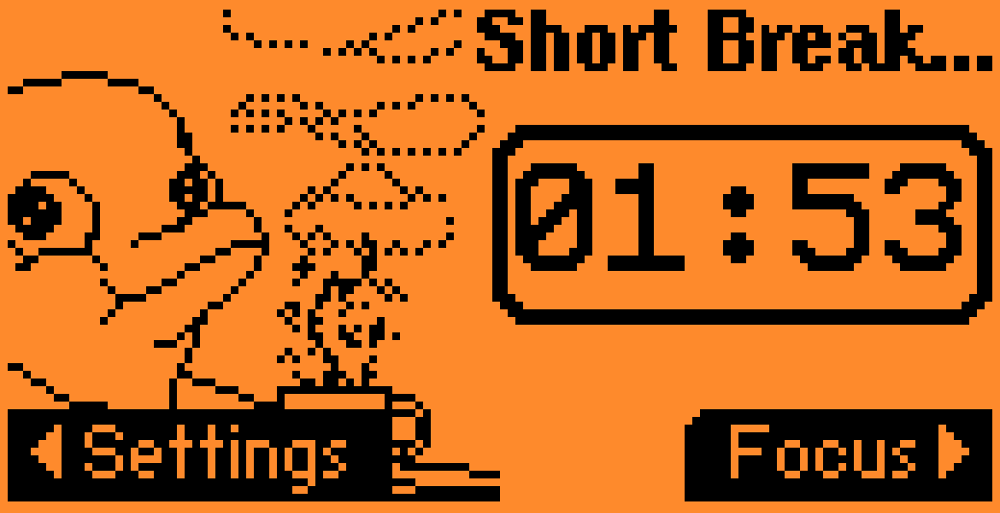

# Flipp Pomodoro


>Boost Your Productivity with the Pomodoro Timer for Flipper Zero! Don't let your flipper get bored, let him help you instead.

* [Install](#install)
* [Guide](#guide)
    + [`Focus` Phase](#-focus--phase)
    + [`Rest` Phase](#-rest--phase)
* [Development](#development)
    + [Current state and plans](#current-state-and-plans)
    + [Build and Package](#build-and-package)

## Install

[DOWNLOAD application from releases](https://github.com/Th3Un1q3/flipp_pomodoro/releases/latest) and follow instructions there.

## Guide
[About Pomodoro Technique](https://francescocirillo.com/products/the-pomodoro-technique)
### `Focus` Phase


Do the following:
* Check your past notes
* Choose a task and note it down
* Work on the task until the Flipp Pomodoro rings
* If task is done during `Focus` phase
    * Review completed work
    * Plan a task to focus on next
    * Reflect what have you have learned
* If task is not complete by the end of the `Focus` phase
    * Place a bookmark and return to it during the next cycle
    * Think how to define task the way it would fit into a single phase
* If there is some distraction(remember: many things can wait 25 minutes)
    * Incomming message - take a note and answer during `Rest` phase
    * Genius idea - note a hint down, plan as a task or return to it when work is done
    * Everything unavoidable - feel free to leave the cycle, once it's mitigated you have task to work on

> Hint: By completing `Focus` phase your flipper gains good mood boost

### `Rest` Phase


Do the following:
* Take a walk around or do a little stretch
* Take some fresh air
* Refill your drink
* Answer pending messages
* Talk to a colleague

## Development

### Current state and plans

https://github.com/users/Th3Un1q3/projects/1

https://github.com/Th3Un1q3/flipp_pomodoro/issues

https://github.com/Th3Un1q3/flipp_pomodoro/discussions

At the moment following functionality implemented:

* Generic pomodoro cycle with two stages (Work: 25 min and rest 5 minutes)
* Automatic and manual phases switch
* Notification(sound, vibration, backlight, led) on stage change.
* Energy Effecient workflow
* Increase flipper happines score when completing pomodoros

Will do(if I've got time):
* ~~Publish a .fap package to let anyone download and install the app.~~
* ~~Configure CI pipeline for automatic releases~~
* Stats on exit(how many pomodoros complete)
* Background work or restore from last state
* ~~Integration with passport to develop your flipper profile by completing pomodoros~~
* Configuration of notifications
* Blind mode(no timer updates, just background and notification) for more energy saving

###  Build and Package
Build application
```shell
# For standard(official) firmware
bash tools/build.sh

# For unleashed firmware
bash tools/build.sh -f unleashed 

# While flipper connected via USB and serial port is not bussy
# Build, run on flipper and keep the app in `Productivity` directory
bash tools/build.sh -f unleashed -i
```
